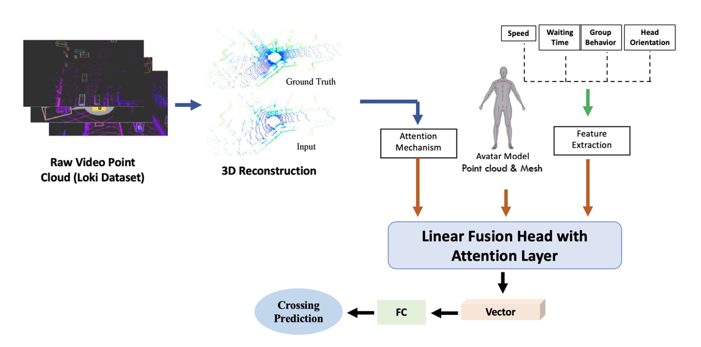

# Pedestrian Crossing Prediction Using Loki Dataset

This repository implements a pedestrian crossing prediction system using data from the Loki dataset. The system leverages 3D reconstruction, attention mechanisms, and pedestrian feature extraction to predict whether pedestrians will cross a street. Below is the framework used for the system:



---

## Overview

The goal of this project is to predict pedestrian crossing behavior using point cloud data collected by the ego-car. The system incorporates a multi-step process as part of the autonomous vehicles research project at AUC University:

1. **Data Source**: Loki dataset's raw point cloud and 3D labels provide spatial pedestrian information.
2. **3D Reconstruction**: The system processes raw 3D point clouds to extract meaningful pedestrian and environmental data.
3. **Pedestrian Modeling**: The pedestrian's key points from the 3D labeld loki dataset extracted to use as model input
4. **Feature Extraction**: Combines features from 2D pedestrian detections in images and 3D pedestrian key points.
5. **Attention Mechanism**: Prioritizes key features relevant to crossing prediction.
6. **Feature Fusion**: Combines inputs through a linear fusion head with attention layers for prediction.
7. **Prediction**: Outputs crossing probabilities through a fully connected (FC) layer.

---

## Features

- **Point Cloud Processing**: Reads and analyzes Loki dataset files.
- **Feature Extraction**: Captures dynamic human and environmental attributes from 2D and 3D data.
- **Crossing Prediction**: Leverages a neural network with an attention mechanism for final predictions.

---

## Inputs

The system relies on three main inputs:
1. **3D Reconstruction**: Processed point clouds from the Loki dataset.
2. **Pedestrian Model**: Key points extracted directly from the 3D pedestrian representation.
3. **2D and 3D Features**: Extracted from pedestrian images and 3D pedestrian key points.

---

## Installation

1. Clone the repository:
   ```bash
   git clone https://github.com/ahmedhagras96/Pedistrian-crossing-prediction.git
   cd pedestrian-crossing-prediction
   ```
2. Install dependencies:
   ```bash
   pip install -r requirements.txt
   ```

---

## Dataset Structure

### Loki Dataset
- **Point Clouds**: 3D environment scans of pedestrian interactions.
- **3D Labels**: Provides pedestrian positions (`track_id`) in the local coordinate system.
- **Odometry**: Used to relate pedestrian positions to the ego-car frame.

### File Naming Convention
- `label3d_00002.txt` and `odom_0002.txt` are matched by their ID.

---

## How It Works

1. **Prediction Pipeline**:
   - Processes raw point clouds.
   - Extracts features from 2D and 3D pedestrian representations.
   - Applies a feature fusion and attention pipeline.
   - Outputs the probability of crossing.

2. **YOLO-LiDAR Fusion**:
   - While not used in training due to known `track_id` mappings, this method is recommended for inference users to identify pedestrians in 2D and 3D environments.

---

## Usage

1. Prepare the Loki dataset and place it in the `data/` directory.
2. Run the main prediction script:
   ```bash
   python main.py --data_path ./data --output_path ./results
   ```

---

## Citation

If you use this repository for your research, please cite appropriately.

---

## License

This project is licensed under the MIT License. See the `LICENSE` file for details.
